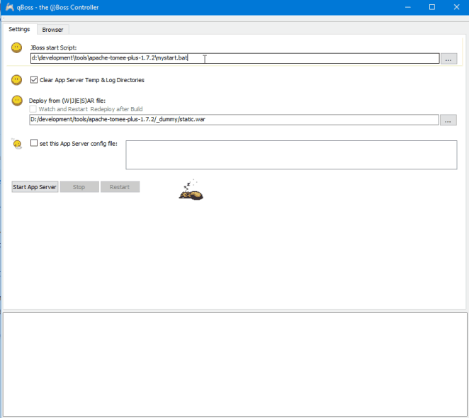

# Desktop App: qBoss

## controls deployment on Java App Servers (like JBoss)

GUI :
#####

## TODO:
	1) Tab: DB Search
	2) Tab: Performance Graph

# .

### General Qt cheatsheet:
[Qt-cheatsheet](https://github.com/privet56/qBoss/blob/master/qt_cheatsheet.md)
